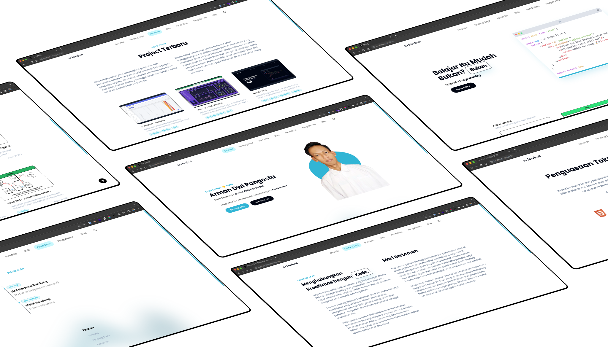

<h1 align="center">Web Portofolio</h1>
<p align="center">Repository ini merupakan web portofolio yang saya buat menggunakan teknologi NextJS dan Tailwind CSS</p>



## Daftar Isi

- [Daftar Isi](#daftar-isi)
- [Menjalankan di Localhost](#menjalankan-di-localhost)
- [Struktur Folder dan File](#struktur-folder-dan-file)
- [List Dynamic Routes](#list-dynamic-routes)

## Menjalankan di Localhost

- Clone repository ini

```bash
git clone --depth=1 https://github.com/armandwipangestu/armandwipangestu.vercel.app portofolio
```

- Instal dependency library

```bash
cd portofolio && yarn install
```

- Copy file `.env.example` ke file `.env.local`

```bash
cp .env.example .env.local
```

- Isikan `.env.local`

```bash
# App Configuration
NEXT_PUBLIC_APP_ENV=development
NEXT_PUBLIC_BASE_URL="http://localhost:3000"
NEXT_PUBLIC_PUBLIC_ASSETS="$NEXT_PUBLIC_BASE_URL/images/posts/assets"

# Giscus Configuration
NEXT_PUBLIC_GISCUS_REPO=username/repository-name
NEXT_PUBLIC_GISCUS_REPO_ID=repository-id
NEXT_PUBLIC_GISCUS_CATEGORY=Category
NEXT_PUBLIC_GISCUS_CATEGORY_ID=category-id
NEXT_PUBLIC_GISCUS_MAPPING=pathname
NEXT_PUBLIC_GISCUS_TERM=

# Umami Configuration
NEXT_PUBLIC_UMAMI_DATA_WEBSITE_ID=umami-id

# Google Analytics Configuration
NEXT_PUBLIC_GA_MEASUREMENT_ID=measurement-id

# PostHog Configuration
NEXT_PUBLIC_POSTHOG_KEY=posthog-api-key
NEXT_PUBLIC_POSTHOG_HOST=https://us.i.posthog.com
```

- Menjalankan di development

```bash
yarn run dev
```

## Struktur Folder dan File

```
components
├── article
│  └── article.js
├── layouts
│  ├── footer.js
│  ├── layout.js
│  └── navigation.js
└── utilities
   ├── icon.js
   ├── JumpToTop.js
   ├── metadata.js
   └── toc.js
pages
├── _app.js
├── _document.js
├── _index_default.js
├── api
│  ├── menu.js
│  └── portofolio.js
├── blog
│  ├── posts
│  │  ├── [slug].js
│  │  └── index.js
│  └── tag
│     └── [tag].js
├── blog.js
├── index.js
├── pendidikan.js
├── pengalaman.js
├── portofolio.js
├── skills.js
└── tentang-saya.js
styles
└── globals.css
utilities
└── sortPostsByDate.js
```

## List Dynamic Routes

| File                    | Function              |
| ----------------------- | --------------------- |
| `/blog/tag/[tag].js`    | DynamicTagPage        |
| `/blog/posts/[slug].js` | DynamicSinglePagePost |
