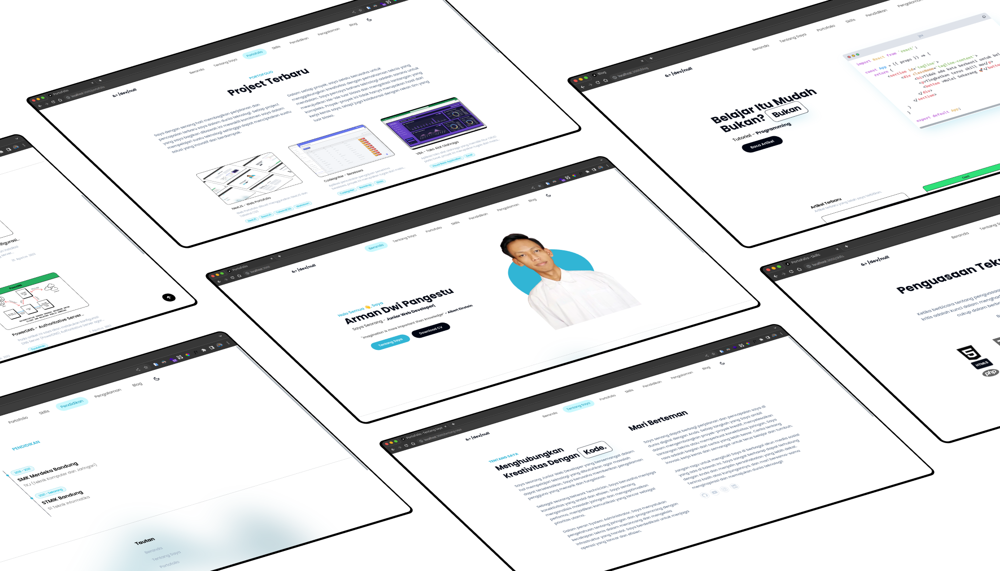

<h1 align="center">Web Portofolio</h1>
<p align="center">Repository ini merupakan web portofolio yang saya buat menggunakan teknologi NextJS dan Tailwind CSS</p>



## Menjalankan di Localhost

- Clone repository ini

```bash
git clone --depth=1 https://github.com/armandwipangestu/armandwipangestu.vercel.app portofolio
```

- Instal dependency library

```bash
cd portofolio && yarn install
```

- Menjalankan di development

```bash
yarn run dev
```

## Struktur Folder dan File

```
components
├── article
│  └── article.js
├── layouts
│  ├── footer.js
│  ├── layout.js
│  └── navigation.js
└── utilities
   ├── icon.js
   ├── JumpToTop.js
   ├── metadata.js
   └── toc.js
pages
├── _app.js
├── _document.js
├── _index_default.js
├── api
│  └── menu.js
│  └── portofolio.js
├── blog
│  ├── posts
│  │  ├── [slug].js
│  │  └── index.js
│  └── tag
│     └── [tag].js
├── blog.js
├── index.js
├── pendidikan.js
├── pengalaman.js
├── portofolio.js
├── skills.js
└── tentang-saya.js
styles
└── globals.css
utilities
└── sortPostsByDate.js
```

## List SSG (Static Site Generator)

| File                    | Function              |
| ----------------------- | --------------------- |
| `/blog/tag/[tag].js`    | DynamicTagPage        |
| `/blog/posts/[slug].js` | DynamicSinglePagePost |

## List NextJS API

| Endpoint          | METHOD |
| ----------------- | ------ |
| `/api/menu`       | GET    |
| `/api/portofolio` | GET    |
